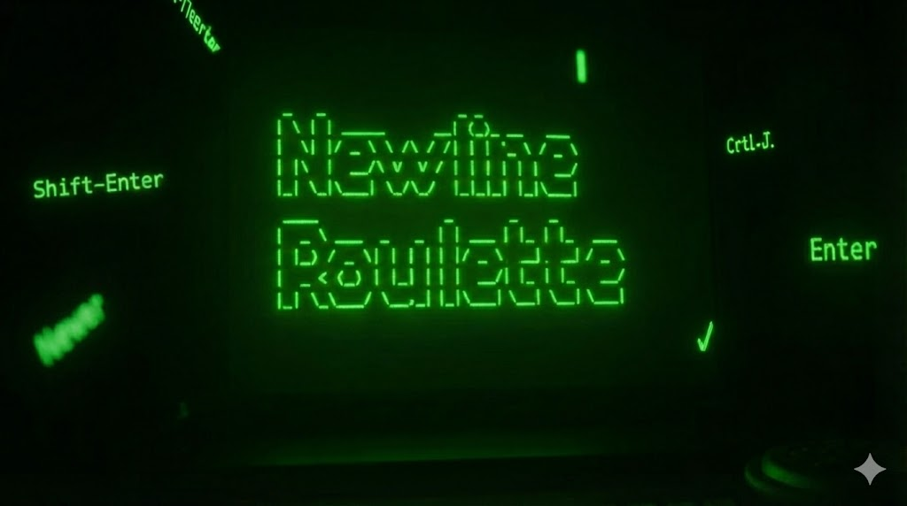

# Newline Roulette

Arcade-style quiz about newline shortcuts across chat apps, editors, and terminals. Keep your streak alive, avoid embarrassing sends, and see how long you can last.



## How to play
- Press any key or hit **Start Game** to begin.
- Read the scenario and pick the newline shortcut you think the app expects.
- Correct answers boost your score and streak; wrong answers burn a life (you get three).
- Survive as many rounds as you can—then hit **Try Again** to chase a higher score.

## Features
- Rotating set of real-world contexts with shuffled shortcut options.
- Immediate feedback with snarky success/embarrassment messages.
- Score, streak, lives tracker, and quick restart.
- CRT-inspired styling with responsive layout.

## Run locally
```sh
npm install
npm run dev
```
Visit http://localhost:5173 to play. You can also lint with `npm run lint` (the current codebase has pre-existing warnings).

## Tech stack
- Vite + React + TypeScript
- Tailwind CSS + shadcn/ui
- TanStack Query and React Router

## Open Graph image
The preview graphic lives at `public/og-image.png`. Reference it in your deployment metadata for rich link previews.
